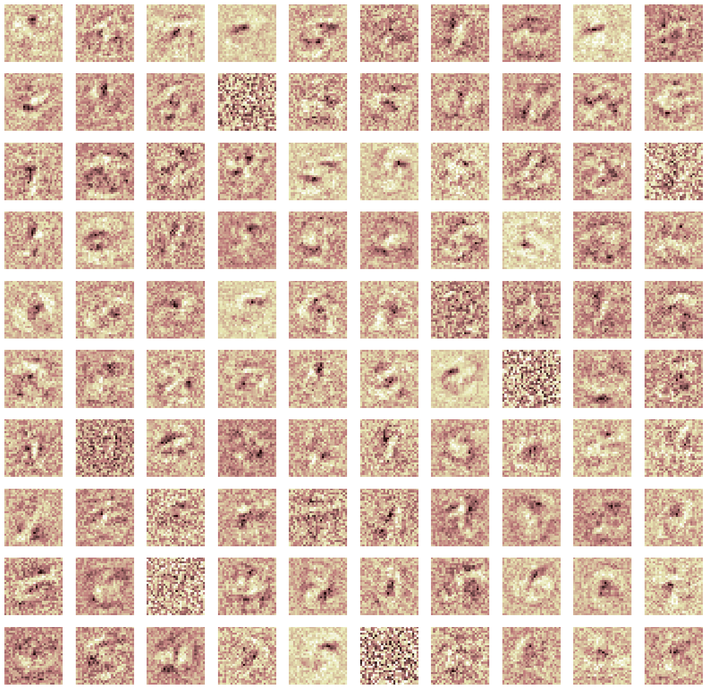

Some thoughts from [Google's Machine Learning Crash Course](https://developers.google.com/machine-learning/crash-course/).

From this [exercise](https://developers.google.com/machine-learning/crash-course/regularization-for-simplicity/playground-exercise-examining-l2-regularization):
Sometimes, overfitting happens slowly. That's why early stopping does work.

Some nots on ROC from [here](https://developers.google.com/machine-learning/crash-course/classification/roc-and-auc).

Interpretation of AUC of ROC is the probability: P(f(positive sample) > f(negative sample))
i.e. the probability of the model assigning a higher score to a randomly selected positive   observation than a randomly selected negative observation.

AUC is scale-invariant. It measures how well predictions are ranked, rather than their absolute values.
AUC is classification-threshold-invariant.

Check for Prediction Bias, which is average of predictions - average of labels in data set. Never thought about it this way. You can also bucket data points and check bias for each bucket.

Sparcity:
L0 optimization is non-convex and NP-hard. Think the knapsack problem. Think of L2 vs L1 this way. Derivative of L2 penalty is 2\*beta, which reduces a percentage of beta at each step. Derivative of L1 penalty is constant, which reduces a constant of beta at each step. This causes the sparsity of L1.  I still like the corners of the level curves argument better.

An excellent exercise [here](https://developers.google.com/machine-learning/crash-course/introduction-to-neural-networks/playground-exercises)

Some thoughts:
A simple network is very sensitive to initialization. What is very interesting is that slightly increasing the complexity makes it less sensitive. That's a little counter-intuitive.

This exercise shows how easy it is for a optimization to get stuck at a local optimum/saddle point.

And part three shows that feature engineering goes a long way. It is makes a model easier to train and more interpretable than using a huge network.

What is also interesting is the following. Say some configuration gives you a nice model and now you make it a little more complex. In theory, the function space is strictly larger and you should get results as least as good as the simpler model, but when running these trials, it often is not the case. A slightly more complex network structure sometimes doesn't let you replicate the performance of the simpler model.

On training of neural networks:

ReLu could die. We could get all values below zero, so are all the derivatives. This means, if a node's value before activation (sum(b\_i\*x)+b\_0, what is this called?) is < 0, then it will be stuck this way? In the playground exercise, just set a node's bias to a large negative number, the weights of that node will never change.

On multi-class nets:

There are two ways. Say you have 5 classes.

First way is to have 5 logistic units, outputing five different probabilities. You can do one-versus-all classification, i.e. you pick the largest and say that is the output label. Note the activation function should be sigmoid here, even though you might have used ReLu in hidden layers.  

Second way is to have a softmax and have the sum of the probabilities forced to be 1.

Note with the first way, you implicitly allow the possibility that one sample could have two labels. For example, when the probs are 0.8, 0.8, 0.2, 0.1, 0.1, like when an image contains two of the five objects that you are trying to classify. With the second way, you are telling the nn: there is only one correct lable.

Candidate sampling helps training efficiency when you have too many output nodes.

In this [exercise](https://developers.google.com/machine-learning/crash-course/multi-class-neural-networks/programming-exercise):

A nn with two hidden layer of 100 nodes was trained to recognize digits. The weights are visualized by plotting them on a grid same size as the input images. Though the network performs well, it's hard to make sense of the weights in the first layer.

